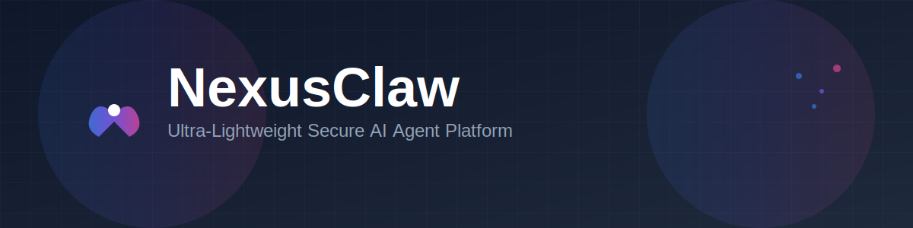

<div align="center">



<br/>

[](https://github.com/nexusclawdev/nexusclaw)
[](LICENSE)
[](https://nodejs.org)
[](https://www.typescriptlang.org)
[](#)
[](CONTRIBUTING.md)

### 🚀 Next-Generation AI Agent Platform

*Browser control meets zero-trust security in a beautifully orchestrated AI agent system*

[Quick Start](#-quick-start) • [Features](#-features) • [Installation](#-installation) • [Documentation](#-documentation) • [Contributing](#-contributing)

</div>

---

---

## 🎯 What is NexusClaw?

NexusClaw is a next-generation AI agent platform that combines the efficiency of lightweight architecture with enterprise-grade security and powerful browser automation. Think of it as your AI-powered command center—orchestrating multiple agents, automating browser tasks, and connecting to your favorite messaging platforms, all while maintaining zero-trust security.

**Built for modern AI workflows:** Advanced multi-agent orchestration + visual dashboard + enterprise security.

---

## ✨ Features

<table>
<tr>
<td width="50%">

### 🤖 Multi-Agent Orchestration
- **CEO Directive System** for intelligent task delegation
- **Department Structure** with specialized agents
- **Real-time Collaboration** via message bus
- **Visual Office Simulation** with React + PixiJS

### 🌐 Browser Automation
- **Playwright Integration** for full browser control
- **Stealth Mode** with anti-detection
- **Docker Isolation** for secure execution
- **Screenshot & Recording** capabilities

### 🔐 Zero-Trust Security
- **Workspace Sandboxing** with configurable restrictions
- **Command Deny Patterns** to prevent dangerous operations
- **Domain Blocking** and URL filtering
- **Per-Channel Access Control**

</td>
<td width="50%">

### 📱 Multi-Channel Support
- **Telegram** bot integration
- **WhatsApp** via Baileys
- **Discord** bot support
- **Web Dashboard** with real-time updates
- **CLI Interface** for direct interaction

### 🧩 Skills Marketplace
- **ClawHub Integration** for community skills
- **Dynamic Installation** at runtime
- **Built-in Skills** registry
- **Custom Skills** support

### ⏰ Task Scheduling
- **Cron Jobs** with full syntax support
- **Persistent Storage** for scheduled tasks
- **Enable/Disable** without deletion
- **Timeout Controls** (5min default)

</td>
</tr>
</table>

### 🔌 LLM Provider Support

<div align="center">

| Provider | Models | Status |
|----------|--------|--------|
| **OpenAI** | GPT-4o, GPT-4, GPT-3.5 | ✅ Supported |
| **Anthropic** | Claude 3.5 Sonnet, Claude 3 Opus | ✅ Supported |
| **Google** | Gemini Pro, Gemini Ultra | ✅ Supported |
| **OpenRouter** | 100+ models | ✅ Supported |
| **xAI** | Grok | ✅ Supported |

</div>

---

## 🚀 Quick Start

Get up and running in under 5 minutes:

```bash
# Clone the repository
git clone https://github.com/nexusclawdev/nexusclaw.git
cd nexusclaw

# Install dependencies
npm install -g pnpm
pnpm install

# Build the project
pnpm build

# Run interactive setup wizard
pnpm cli onboard

# Start the gateway (dashboard + agents + channels)
pnpm cli gateway
```

**Dashboard:** http://localhost:3100
**API:** http://localhost:3100/api
**WebSocket:** ws://localhost:3100/ws

---

## 📦 Installation

### Prerequisites

- **Node.js** 20.0.0 or higher
- **pnpm** (recommended) or npm
- **Git** for cloning the repository

### Platform-Specific Setup

<details>
<summary><b>Windows</b></summary>

```powershell
# Install Node.js via winget
winget install OpenJS.NodeJS.LTS

# Install pnpm
npm install -g pnpm

# Clone and setup
git clone https://github.com/nexusclawdev/nexusclaw.git
cd nexusclaw
pnpm install
pnpm build

# Run setup wizard
pnpm cli onboard
```

**Alternative:** Use the automated installer:
```powershell
.\install.ps1
```

</details>

<details>
<summary><b>macOS</b></summary>

```bash
# Install Node.js via Homebrew
brew install node@20

# Install pnpm
npm install -g pnpm

# Clone and setup
git clone https://github.com/nexusclawdev/nexusclaw.git
cd nexusclaw
pnpm install
pnpm build

# Run setup wizard
pnpm cli onboard
```

**Alternative:** Use the automated installer:
```bash
./install.sh
```

</details>

<details>
<summary><b>Linux</b></summary>

```bash
# Install Node.js (Ubuntu/Debian)
curl -fsSL https://deb.nodesource.com/setup_20.x | sudo -E bash -
sudo apt-get install -y nodejs

# Install pnpm
npm install -g pnpm

# Clone and setup
git clone https://github.com/nexusclawdev/nexusclaw.git
cd nexusclaw
pnpm install
pnpm build

# Run setup wizard
pnpm cli onboard
```

**Alternative:** Use the automated installer:
```bash
./install.sh
```

</details>

### Docker Installation

```bash
# Build the image
docker build -t nexusclaw .

# Run with docker-compose
docker-compose up -d
```

---

## 🎮 Usage

### Essential Commands

```bash
# Interactive setup wizard (run this first!)
pnpm cli onboard

# Start the full platform (recommended)
pnpm cli gateway

# Chat with agent via CLI
pnpm cli agent

# Check system status
pnpm cli status

# Diagnose issues
pnpm cli doctor

# Link command globally
pnpm cli setup

# Development mode with auto-reload
pnpm dev
```

### Skills Management

```bash
# List installed skills
pnpm cli skills list

# Search ClawHub marketplace
pnpm cli skills search weather

# Install a skill
pnpm cli skills install weather

# Show skill details
pnpm cli skills show weather

# Remove a skill
pnpm cli skills remove weather
```

### Task Scheduling

```bash
# List all cron jobs
pnpm cli cron list

# Add a daily task at 9 AM
pnpm cli cron add "0 9 * * *" "Send daily summary"

# Add an hourly health check
pnpm cli cron add "0 * * * *" "Check system health"

# Enable/disable a job
pnpm cli cron enable <job-id>
pnpm cli cron disable <job-id>

# Remove a job
pnpm cli cron remove <job-id>
```

### Authentication

```bash
# Check OAuth status
pnpm cli auth status

# Login with a provider
pnpm cli auth login --provider google

# Logout
pnpm cli auth logout --provider google
pnpm cli auth logout --all
```

### Migration

```bash
# Auto-detect and import from legacy agent platforms
pnpm cli migrate

# Import from specific source
pnpm cli migrate --from legacy-a --path /path/to/source
pnpm cli migrate --from legacy-b --path /path/to/source
```

---

## 🏗️ Architecture

```
┌─────────────────────────────────────────────────────────────┐
│                      NexusClaw Platform                      │
├─────────────────────────────────────────────────────────────┤
│                                                               │
│  ┌──────────────┐  ┌──────────────┐  ┌──────────────┐      │
│  │   Telegram   │  │   WhatsApp   │  │   Discord    │      │
│  │   Channel    │  │   Channel    │  │   Channel    │      │
│  └──────┬───────┘  └──────┬───────┘  └──────┬───────┘      │
│         │                  │                  │              │
│         └──────────────────┼──────────────────┘              │
│                            │                                 │
│                    ┌───────▼────────┐                        │
│                    │  Message Bus   │                        │
│                    │  (Event-Driven)│                        │
│                    └───────┬────────┘                        │
│                            │                                 │
│         ┌──────────────────┼──────────────────┐             │
│         │                  │                  │             │
│  ┌──────▼───────┐  ┌──────▼───────┐  ┌──────▼───────┐     │
│  │     CEO      │  │  Department  │  │  Department  │     │
│  │   Director   │  │   Agents     │  │   Agents     │     │
│  └──────┬───────┘  └──────┬───────┘  └──────┬───────┘     │
│         │                  │                  │             │
│         └──────────────────┼──────────────────┘             │
│                            │                                 │
│                    ┌───────▼────────┐                        │
│                    │  LLM Providers │                        │
│                    │  (Multi-Model) │                        │
│                    └────────────────┘                        │
│                                                               │
│  ┌─────────────────────────────────────────────────────┐   │
│  │              Security Layer (Zero-Trust)             │   │
│  │  • Workspace Sandboxing  • Command Filtering         │   │
│  │  • Domain Blocking       • Access Control            │   │
│  └─────────────────────────────────────────────────────┘   │
│                                                               │
└─────────────────────────────────────────────────────────────┘
```

### Core Components

- **Message Bus**: Event-driven architecture for agent communication
- **CEO Director**: Intelligent task delegation and orchestration
- **Department Agents**: Specialized agents for different domains
- **Security Guard**: Zero-trust security enforcement
- **Browser Engine**: Playwright-powered automation
- **Skills Registry**: Dynamic skill loading and management
- **Cron Scheduler**: Persistent task scheduling
- **OAuth Manager**: Multi-provider authentication

---

## ⚙️ Configuration

### Configuration File Location

```
Windows: C:\Users\YourName\.nexusclaw\config.json
macOS:   /Users/YourName/.nexusclaw/config.json
Linux:   /home/yourname/.nexusclaw/config.json
```

### Example Configuration

```json
{
  "providers": {
    "openai": {
      "apiKey": "sk-...",
      "model": "gpt-4o"
    },
    "anthropic": {
      "apiKey": "sk-ant-...",
      "model": "claude-3-5-sonnet-20241022"
    }
  },
  "agents": {
    "defaults": {
      "model": "gpt-4o",
      "temperature": 0.7,
      "maxTokens": 4096
    }
  },
  "channels": {
    "telegram": {
      "enabled": true,
      "token": "YOUR_BOT_TOKEN",
      "allowFromUserIds": [123456789]
    },
    "whatsapp": {
      "enabled": false
    },
    "web": {
      "enabled": true,
      "port": 3100,
      "host": "0.0.0.0"
    }
  },
  "security": {
    "restrictToWorkspace": true,
    "commandDenyPatterns": [
      "rm\\s+-rf\\s+/",
      "format\\s+c:",
      "del\\s+/f\\s+/s\\s+/q"
    ],
    "allowedDomains": [
      "github.com",
      "stackoverflow.com"
    ]
  },
  "browser": {
    "headless": true,
    "stealth": true,
    "dockerIsolation": false
  },
  "cron": {
    "enabled": true,
    "defaultTimeout": 300000
  }
}
```

### Environment Variables

Create a `.env` file in the project root:

```bash
# LLM Provider (openai | anthropic | openrouter | xai | google)
LLM_PROVIDER=openai
OPENAI_API_KEY=sk-...
ANTHROPIC_API_KEY=sk-ant-...
OPENROUTER_API_KEY=sk-or-...
XAI_API_KEY=xai-...
GOOGLE_API_KEY=...

# Model Selection
LLM_MODEL=gpt-4o

# Server Configuration
PORT=3100
HOST=0.0.0.0

# Encryption (64 hex chars = 256-bit key)
ENCRYPTION_KEY=your-256-bit-hex-key

# Telegram
TELEGRAM_BOT_TOKEN=your-bot-token

# Discord
DISCORD_BOT_TOKEN=your-bot-token

# Redis (optional)
REDIS_URL=redis://localhost:6379

# Security
RESTRICT_TO_WORKSPACE=false
```

---

## 🔑 Getting API Keys

<details>
<summary><b>OpenAI (GPT-4, GPT-4o)</b></summary>

1. Visit [OpenAI Platform](https://platform.openai.com/api-keys)
2. Sign in or create an account
3. Navigate to API Keys section
4. Click "Create new secret key"
5. Copy the key (starts with `sk-`)
6. Add to `.env` or config file

</details>

<details>
<summary><b>Anthropic (Claude)</b></summary>

1. Visit [Anthropic Console](https://console.anthropic.com/)
2. Sign in or create an account
3. Navigate to API Keys
4. Create a new key (starts with `sk-ant-`)
5. Copy and save securely
6. Add to `.env` or config file

</details>

<details>
<summary><b>Google (Gemini)</b></summary>

1. Visit [Google AI Studio](https://makersuite.google.com/app/apikey)
2. Sign in with Google account
3. Create API key
4. Copy the key
5. Add to `.env` or config file

</details>

<details>
<summary><b>OpenRouter (100+ Models)</b></summary>

1. Visit [OpenRouter](https://openrouter.ai/keys)
2. Sign in or create an account
3. Create API key
4. Copy the key (starts with `sk-or-`)
5. Add to `.env` or config file

</details>

<details>
<summary><b>xAI (Grok)</b></summary>

1. Visit [xAI Console](https://console.x.ai/)
2. Sign in or create an account
3. Create API key
4. Copy the key
5. Add to `.env` or config file

</details>

---

## 🤝 Contributing

We welcome contributions! Here's how you can help:

### Development Setup

```bash
# Fork and clone the repository
git clone https://github.com/nexusclawdev/nexusclaw.git
cd nexusclaw

# Install dependencies
pnpm install

# Create a feature branch
git checkout -b feature/amazing-feature

# Make your changes and test
pnpm dev

# Run type checking
pnpm typecheck

# Build to verify
pnpm build

# Commit your changes
git commit -m "Add amazing feature"

# Push to your fork
git push origin feature/amazing-feature

# Open a Pull Request
```

### Contribution Guidelines

- Follow TypeScript best practices
- Add tests for new features
- Update documentation as needed
- Keep commits atomic and well-described
- Ensure all tests pass before submitting PR

See [CONTRIBUTING.md](CONTRIBUTING.md) for detailed guidelines.

---

## 📚 Documentation

- [Quick Start Guide](QUICKSTART.md) - Get started in 5 minutes
- [Installation Guide](INSTALLATION.md) - Detailed installation instructions
- [CLI Reference](QUICK_REFERENCE.md) - Complete command reference
- [Architecture Overview](docs/architecture/README.md) - System design and structure
- [API Documentation](docs/api.md) - REST API and WebSocket reference
- [Changelog](CHANGELOG.md) - Version history and updates

---

## 🎯 Key Advantages

| Feature | NexusClaw |
|---------|-----------|
| **Language** | TypeScript |
| **Memory Usage** | ~50-100MB |
| **Boot Time** | ~2-3s |
| **Visual Dashboard** | ✅ |
| **Browser Automation** | ✅ |
| **Multi-Agent Orchestration** | ✅ |
| **Skills Marketplace** | ✅ |
| **Cron Scheduling** | ✅ |
| **OAuth 2.0** | ✅ |
| **Real-time Updates** | ✅ |
| **Enterprise Security** | ✅ |

**Perfect for:** Teams needing visual dashboard, browser automation, multi-agent orchestration, and enterprise-grade security.

---

## 🛠️ Troubleshooting

<details>
<summary><b>Build Errors</b></summary>

```bash
# Clean and rebuild
rm -rf dist node_modules
pnpm install
pnpm build
```

</details>

<details>
<summary><b>Port Already in Use</b></summary>

Change the port in your config file:
```json
{
  "channels": {
    "web": {
      "port": 3200
    }
  }
}
```

</details>

<details>
<summary><b>Playwright Installation Issues</b></summary>

```bash
# Install Playwright browsers
npx playwright install

# Install system dependencies (Linux)
npx playwright install-deps
```

</details>

<details>
<summary><b>Missing Dependencies</b></summary>

```bash
# Force reinstall
pnpm install --force

# Clear cache and reinstall
pnpm store prune
pnpm install
```

</details>

---

## 📊 Project Status

- **Version:** 0.1.0
- **Status:** Production Ready
- **Build:** Passing
- **Test Coverage:** In Progress
- **Documentation:** Complete

### Roadmap

- [ ] ClawHub API integration
- [ ] Advanced browser automation features
- [ ] Skills hot reload
- [ ] Token encryption at rest
- [ ] Provider fallback chain
- [ ] Rate limiting with exponential backoff
- [ ] Cron job execution logs
- [ ] Mobile app (React Native)

---

## 📄 License

This project is licensed under the Apache License 2.0 - see the [LICENSE](LICENSE) file for details.

```
Copyright 2026 NexusClaw Project

Licensed under the Apache License, Version 2.0 (the "License");
you may not use this file except in compliance with the License.
You may obtain a copy of the License at

    http://www.apache.org/licenses/LICENSE-2.0

Unless required by applicable law or agreed to in writing, software
distributed under the License is distributed on an "AS IS" BASIS,
WITHOUT WARRANTIES OR CONDITIONS OF ANY KIND, either express or implied.
See the License for the specific language governing permissions and
limitations under the License.
```

---

## 🙏 Acknowledgments

- **Playwright** - Browser automation framework
- **Anthropic** - Claude AI models
- **OpenAI** - GPT models
- **The Open Source Community** - For amazing tools and libraries

---

## 🔗 Links

- **GitHub Repository:** [github.com/nexusclawdev/nexusclaw](https://github.com/nexusclawdev/nexusclaw)
- **Documentation:** [docs.nexusclaw.dev](https://docs.nexusclaw.dev)
- **Discord Community:** [discord.gg/nexusclaw](https://discord.gg/nexusclaw)
- **Twitter:** [@nexusclaw](https://twitter.com/nexusclaw)
- **Issue Tracker:** [github.com/nexusclawdev/nexusclaw/issues](https://github.com/nexusclawdev/nexusclaw/issues)

---

## 💬 Support

Need help? We're here for you:

- **GitHub Issues:** Report bugs and request features
- **Discussions:** Ask questions and share ideas
- **Discord:** Join our community for real-time support
- **Email:** support@nexusclaw.dev

---

<div align="center">

**🐾 Built with ❤️ by the NexusClaw Team**

*Next-generation AI agent platform for modern workflows*

[⬆ Back to Top](#-nexusclaw)

</div>
